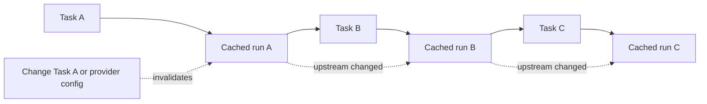

Rigkit is useful because setup work is durable. Expensive tasks can run once,
write JSON context to the state database, and be reused by later plans,
applies, workspace creates, and operations.



Rigkit tracks upstream run ids, so a change to one task affects the dependent
part of the graph without forcing unrelated work to rerun.

## What is cached

Rigkit caches task outputs, not live resources. A task output is the `ctx`
object returned by the task.

```ts
.task("prepare", async ({ freestyle }) => {
  const { vm, vmId } = await freestyle.client.vms.create({
    logger: console.log,
  });

  try {
    const snapshot = await vm.snapshot();
    return {
      ctx: {
        snapshotId: snapshot.snapshotId,
      },
    };
  } finally {
    await freestyle.client.vms.delete({ vmId });
  }
});
```

The VM object is not cached. The durable `snapshotId` is cached.

## Cache keys

A cached task run is reusable only when it still matches the current graph.
Rigkit considers:

- the task path and name;
- the task handler fingerprint;
- the merged `.configure(...)` stack;
- the output schema;
- upstream cached run ids;
- the workflow provider fingerprint;
- the task `cacheTTL`;
- provider artifact validation, when a provider implements it.

Provider fingerprints include provider ids, resolved provider config, and
provider plugin identity. Changing provider config can make cached runs
unusable.

## Local cache

Local cache is stored in the project:

```text
.rigkit/state.sqlite
```

It contains local task runs and workspace records for the selected config.
`.rigkit/` should stay out of source control.

## Global fragments

`.global()` moves a node and its children into a global fragment cache for that
Rigkit installation. When using the CLI, the default fragment state lives at:

```text
~/.rigkit/fragments/<fragment-hash>/state.sqlite
```

Set `RIGKIT_HOME` to move the Rigkit home directory. Hosts that embed the
engine directly can also provide their own global fragment root.

The fragment hash is based on the fragment graph and provider fingerprint.
When two workflows use the same global fragment graph with the same provider
config, they can reuse the same cached setup.

Use global fragments for expensive shared setup, such as:

- base VM images;
- language toolchains;
- authenticated CLI initialization that is intentionally shared;
- warmed package stores.

Be careful with credentials. If a global fragment snapshots authenticated
state, that is the cache boundary you are choosing.

## Returning to local cache

`.local()` switches a subtree back to local cache after a global fragment.

```ts
const base = app.sequence("base").global().task("install-tooling", async () => {
  return { ctx: { snapshotId: "snap_base" } };
});

const repo = app.sequence<{ snapshotId: string }>("repo").local().task(
  "clone-repo",
  async ({ step }) => ({
    ctx: {
      ...step.ctx,
      repoPath: "/workspace/app",
    },
  }),
);
```

This is useful when the base should be shared but repo-specific work should
stay in the project cache.

## Expiring task output

Use `cacheTTL` for output that should be considered stale after a duration:

```ts
.task(
  "check-auth",
  { cacheTTL: "30m" },
  async ({ step }) => {
    return { ctx: step.ctx };
  },
);
```

Supported string units are `ms`, `s`, `m`, `h`, and `d`. `cacheTTL: 0` makes
the task run every apply.

## Invalidate a previous task from a later task

Tasks can invalidate earlier task output by name. This is useful for health
checks that run after repo setup but discover stale shared state.

```ts
.task("github-auth", async ({ step }) => {
  return {
    ctx: {
      ...step.ctx,
      authenticated: true,
    },
  };
})
.task("check-auth", { cacheTTL: 0 }, async ({ step, freestyle }) => {
  const ok = await checkGitHubAuth(freestyle, step.ctx.snapshotId);
  if (!ok) {
    return step.invalidate("github-auth");
  }
  return { ctx: step.ctx };
});
```

When invalidation happens, Rigkit invalidates the target cached run and the
current task, then restarts evaluation so the workflow can rebuild from the
refreshed task.

## Manual cache commands

List cache entries:

```sh
rig cache ls
```

Invalidate one task path:

```sh
rig cache invalidate install-tooling
```

Invalidate every task in the selected workflow:

```sh
rig cache invalidate --all
```

Clear local cache:

```sh
rig cache clear --local
```

Clear global fragments reachable from the current workflow:

```sh
rig cache clear --global
```

Clear all known global fragments without loading a config:

```sh
rig cache clear --global --all
```

## Workspace state

Workspaces are stored separately from task runs in the same project state
database. The workspace record includes:

- workspace name;
- workflow name;
- final workflow context used to create the workspace;
- workspace context returned by `workspace.create`;
- timestamps.

Removing a workspace calls the configured `remove` hook and then deletes the
workspace record.

## Provider host storage

Provider host credentials are separate from workflow cache. For example,
Freestyle browser login stores provider-owned credentials outside project state
so deleting `.rigkit/state.sqlite` does not necessarily log the user out of
Freestyle.

Custom providers receive both project provider storage and host provider
storage. Use host storage for developer-machine credentials, and project
storage for project-scoped JSON state.
