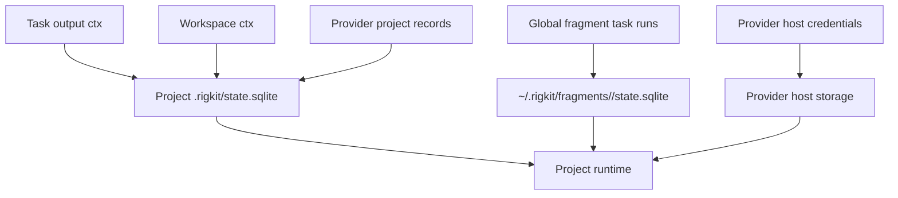

Provider integrations often need state, but not all state belongs in task
context. Rigkit separates workflow cache, workspace records, global fragments,
provider project storage, and provider host storage.



## Task context

Task context is durable workflow output. It is persisted and reused by later
plans, applies, workspace creates, and operations.

Good task context:

- resource ids;
- snapshot ids;
- workspace paths;
- ports;
- branch names;
- provider artifact refs;
- non-secret metadata needed by later tasks.

Avoid task context for live clients, functions, streams, short-lived process
handles, or accidental secrets.

## Workspace context

Workspace context is returned from `workspace.create` and stored until
`workspace.remove` runs:

```ts
return {
  vmId,
  repoPath: workflow.ctx.repoPath,
  devPort: workflow.ctx.devPort,
};
```

Workspace operations read this context through `workspace.ctx`.

## Provider project storage

Custom providers receive `storage` in `createProvider(...)`. Use it for
project-scoped provider records:

```ts
storage.set("branch:br_123", {
  provider: "acme-db",
  kind: "branch",
  branchId: "br_123",
});

const branch = storage.get("branch:br_123");
```

Provider project storage is JSON-only and lives with the selected project
state.

## Provider host storage

Custom providers also receive `hostStorage`. Use it for developer-machine
credentials or login state that should not be deleted with the project cache.

Freestyle browser login uses provider-owned host storage. That is why deleting
`.rigkit/state.sqlite` does not necessarily log the user out of Freestyle.

## Global fragment storage

With the CLI, global fragments live under:

```text
~/.rigkit/fragments/<hash>/state.sqlite
```

Set `RIGKIT_HOME` to move the Rigkit home directory. Embedded hosts can pass a
custom global fragment root.

Global fragments are shared cache boundaries. If a global fragment snapshots
authenticated CLI state, that authenticated state is intentionally shared by
workflows that reuse the same fragment hash.

## Storage rules of thumb

- Put workflow outputs in task context.
- Put workspace resource ids in workspace context.
- Put provider implementation records in provider project storage.
- Put developer credentials in provider host storage.
- Put expensive reusable setup in global fragments only when sharing is
  intended.
- Never return a secret in task context unless you are comfortable caching it.
