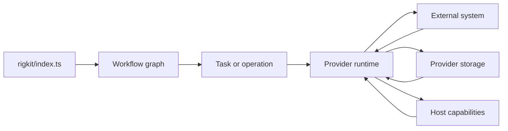
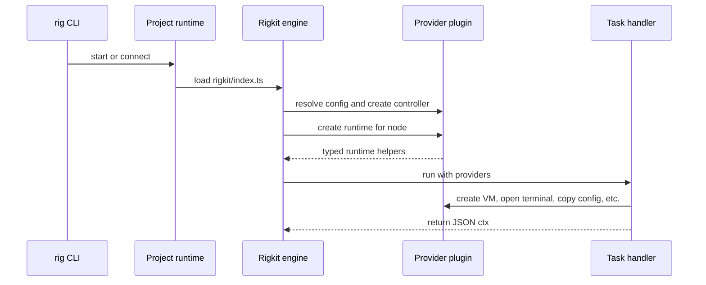

Providers are the integration boundary between a Rigkit workflow and an
external system — VMs, terminals, editors, cloud APIs, or local tools. Your
config picks providers from a package and configures them; tasks and operations
call into them.

## Built-in providers

Rigkit ships with these providers out of the box:

| Provider | Package | Use it for |
| --- | --- | --- |
| [Freestyle](/v0.2.10/providers/freestyle) | `@rigkit/provider-freestyle` | VMs, snapshots, SSH options, VS Code URLs, and Freestyle SDK access. |
| [Terminal](/v0.2.10/providers/terminal) | `@rigkit/provider-freestyle` | Provider-owned browser terminal sessions for interactive setup or SSH. |
| [cmux](/v0.2.10/providers/cmux) | `@rigkit/provider-cmux` | Opening local cmux workspaces with remote SSH sessions and preview URLs. |
| [gcloud](/v0.2.10/providers/gcloud) | `@rigkit/provider-gcloud-cli` | Copying local `gcloud` auth/config files into a workspace. |

Need something else? See [Creating providers](/v0.2.10/providers/creating-providers)
for building your own.

## Add providers to a workflow

Providers are declared where the workflow is created:

```ts
import { workflow } from "@rigkit/sdk";
import { cmux } from "@rigkit/provider-cmux";
import { freestyle } from "@rigkit/provider-freestyle";

const app = workflow("website", {
  providers: {
    freestyle: freestyle.provider(),
    terminal: freestyle.terminal(),
    cmux: cmux.provider(),
  },
});
```

Inside tasks and operations, providers are available in two equivalent ways:

```ts
.task("prepare", async ({ freestyle, providers }) => {
  await freestyle.client.vms.create({ logger: console.log });
  await providers.freestyle.client.vms.create({ logger: console.log });
});
```

The flattened form is convenient for normal tasks. The `providers` object is
useful when passing provider maps around.

## Environment-backed config

`@rigkit/sdk` exports `env(...)` for required environment variables:

```ts
import { env, workflow } from "@rigkit/sdk";
import { freestyle } from "@rigkit/provider-freestyle";

const app = workflow("website", {
  providers: {
    freestyle: freestyle.provider({
      apiKey: env.secret("FREESTYLE_API_KEY"),
    }),
  },
});
```

Rigkit loads `.env` from the project directory before loading the config.
Provider config is part of the provider fingerprint, so changing it can make
cached task runs unusable.

## How providers fit in

<Note>
The rest of this page covers provider architecture — useful if you're writing
configs that lean on providers heavily, or about to author your own. CLI users
can stop here.
</Note>

A workflow describes what environment should exist. Providers know how to make
that environment real. They are responsible for:

- resolving provider config and authentication;
- creating runtime helpers used by tasks, workspaces, and operations;
- owning external resources such as VMs, browser terminals, editor URLs, local
  host capabilities, or cloud resources;
- storing provider-specific state outside normal task context;
- validating cached artifact refs when remote resources might disappear.



Tasks should read like environment setup, not infrastructure plumbing:

```ts
.task("prepare-image", async ({ freestyle }) => {
  const { vm, vmId } = await freestyle.client.vms.create({
    logger: console.log,
  });

  try {
    await vm.exec("corepack enable");
    const snapshot = await vm.snapshot();
    return { ctx: { snapshotId: snapshot.snapshotId } };
  } finally {
    await freestyle.client.vms.delete({ vmId });
  }
});
```

The task uses the Freestyle provider runtime. The provider owns how the
Freestyle client is authenticated, how SSH options are created, how terminal
sessions are presented, and where host credentials live.

## Provider lifecycle



Provider controllers are created from provider definitions. Runtime helpers are
created for each task or operation with node-specific context such as workflow
name, node path, metadata, local host helpers, and interaction presentation.

## What belongs in task context

Task context is for durable workflow output:

- `snapshotId`;
- `vmId`;
- `repoPath`;
- `branch`;
- `devPort`;
- provider artifact refs shaped like `{ provider, kind, ... }`.

Provider implementation details belong in provider storage. Developer-machine
credentials belong in provider host storage. Live SDK clients, functions,
streams, and temporary handles should not be returned from tasks.

For the full picture of where state lives (task context, workspace context,
provider storage, host storage, global fragments), see
[Cache and state](/v0.2.10/concepts/cache-and-state).

## Next pages

- [Freestyle provider](/v0.2.10/providers/freestyle) covers VM, snapshot, SSH, cmux,
  and VS Code helpers.
- [Terminal provider](/v0.2.10/providers/terminal) covers browser terminal sessions.
- [cmux provider](/v0.2.10/providers/cmux) covers local cmux integration.
- [gcloud provider](/v0.2.10/providers/gcloud) covers copying local Google Cloud CLI
  state into workspaces.
- [Creating providers](/v0.2.10/providers/creating-providers) covers custom provider
  packages.
