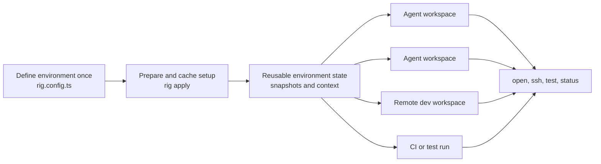

Rigkit lets you define an environment once, then create as many working copies
as you need for agents, developers, CI jobs, and tests. A Rigkit config
describes the setup steps, provider resources, credentials, tools, services,
and actions that make the environment useful.

Instead of writing a setup checklist, you write a `rig.config.ts` file. Rigkit
plans the graph, caches expensive setup, creates named workspaces from prepared
state, and exposes typed operations such as `open`, `ssh`, `status`, or
anything your project needs.



```ts
import { workflow } from "@rigkit/sdk";
import { freestyle, VmSpec } from "@rigkit/provider-freestyle";

const app = workflow("website", {
  providers: {
    freestyle: freestyle.provider(),
    terminal: freestyle.terminal(),
  },
});

export default app
  .sequence("website")
  .task("prepare-image", async ({ freestyle }) => {
    const { vm, vmId } = await freestyle.client.vms.create({
      spec: new VmSpec().runCommands("corepack enable"),
      logger: console.log,
    });

    try {
      const snapshot = await vm.snapshot();
      return { ctx: { snapshotId: snapshot.snapshotId, repoPath: "/workspace/app" } };
    } finally {
      await freestyle.client.vms.delete({ vmId });
    }
  })
  .workspace({
    create: async ({ workflow, providers }) => {
      const { vmId } = await providers.freestyle.client.vms.create({
        snapshotId: workflow.ctx.snapshotId,
        logger: console.log,
      });
      return { vmId, repoPath: workflow.ctx.repoPath };
    },
    remove: async ({ providers, workspace }) => {
      await providers.freestyle.client.vms.delete({ vmId: workspace.ctx.vmId });
    },
  })
  .workspaceOperation("ssh", {
    title: "SSH",
    run: async ({ providers, workspace }) => {
      await providers.terminal.open(`SSH ${workspace.name}`, {
        ssh: await providers.freestyle.createSSHOptions({
          vmId: workspace.ctx.vmId,
        }),
        command: `cd ${workspace.ctx.repoPath} && exec bash -l`,
        keepOpenAfterCommand: true,
      });
    },
  });
```

## What Rigkit is good at

- **Defining complete environments.** Put the VM image, packages, repository,
  credentials, CLIs, services, ports, editor entry points, and project actions
  in one typed config.
- **Spinning up agents.** Prepare the environment once, snapshot it, then create
  isolated named workspaces for agents that need the same tools and context.
- **Remote development.** Create a remote workspace from the same prepared
  state and open it in SSH, cmux, VS Code, or a preview URL.
- **CI and testing.** Use the same workflow model to build repeatable test
  environments, run validation tasks, and reuse expensive setup across runs.
- **Typed workflow authoring.** Each task returns JSON context. The next task,
  workspace lifecycle hook, or operation receives that context with TypeScript
  inference.
- **Provider-owned resources.** Freestyle VMs, terminal sessions, cmux panes,
  VS Code URLs, gcloud config copies, and custom provider resources all live
  behind provider runtimes.
- **Graph-based caching.** Rigkit caches task outputs by task code, upstream
  runs, provider config, output schema, and fragment scope, so dependent work
  reruns only when it needs to.
- **Reusable fragments.** Share expensive base setup across repos, then compose
  repo-specific tasks on top.

## First steps

Install the CLI:

```sh
curl -fsSL https://www.rigkit.dev/install | sh
```

Create a project:

```sh
rig init --name website --package-manager pnpm
cd website
rig plan
rig apply
rig create dev
```

Then run project-defined workspace operations:

```sh
rig run dev ssh
```

## How to read these docs

Start with [Quickstart](/v0.2.8/guides/quickstart) if you want a working project.
Read [Concepts](/v0.2.8/concepts/mental-model) when you want the mental model behind
tasks, context, providers, caches, and workspaces.

When you are ready to write real project configs, use:

- [Workflows](/v0.2.8/guides/workflows) for `workflow`, `sequence`, `.task`,
  `.parallel`, `.configure`, and output validation.
- [Workspaces and operations](/v0.2.8/guides/workspaces) for `rig create`,
  `rig run`, lifecycle hooks, and operation inputs.
- [Providers](/v0.2.8/providers/overview) for Freestyle, terminal sessions, cmux,
  gcloud, custom providers, and provider storage boundaries.
- [Advanced fragments](/v0.2.8/advanced/fragments) for reusable global bases and
  wrapper fragments.
- [Creating providers](/v0.2.8/providers/creating-providers) for building your own
  provider package.

Questions and examples live in the
[Rigkit GitHub repo](https://github.com/freestyle-sh/rigkit). You can also
[join the Discord](https://discord.com/invite/v5WT4fbXhc).
